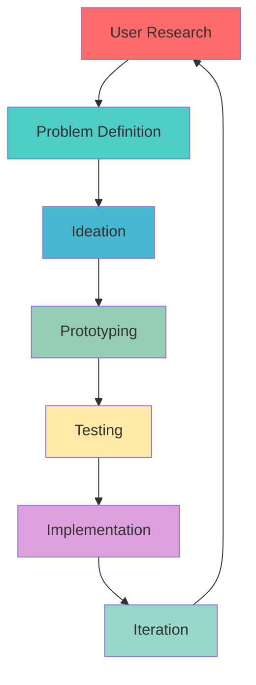

<div align="center">


[](https://git.io/typing-svg)

</div>

---

## 👨‍💻 About Me

```typescript
const imran = {
    role: "Product Designer & AI Enthusiast",
    focus: ["User Experience", "AI/ML Products", "Design Systems"],
    currentlyBuilding: ["AI-powered design tools", "Intelligent interfaces"],
    philosophy: "Design is not just what it looks like—it's how it works",
    approach: "User-centered design meets cutting-edge technology"
};
```

🎨 **Product Designer** passionate about creating intuitive, beautiful experiences  
🤖 **AI Enthusiast** building the next generation of intelligent products  
🚀 **Innovation Driver** bridging design and technology to solve real problems  

---

## 🚀 Featured AI Products

<table>
<tr>
<td width="50%">

### 🎯 AI Portfolio
*Intelligent portfolio showcase platform*


**Features:**
- Smart content generation
- Adaptive user interfaces
- Performance analytics
- Real-time optimization

[📖 View Project](https://github.com/imsaif/imranaiportfolio)

</td>
<td width="50%">

### 🧠 AIEX Platform
*AI-driven user experience optimizer*


**Features:**
- Behavioral pattern analysis
- Intelligent A/B testing
- Automated UX insights
- Conversion optimization

[📖 View Project](https://github.com/imsaif/aiex)

</td>
</tr>
<tr>
<td width="50%">

### 📚 CourseLib
*Intelligent learning management system*


**Features:**
- Personalized learning paths
- Smart content curation
- Progress tracking
- Interactive assessments

[📖 View Project](https://github.com/imsaif/courselib)

</td>
<td width="50%">

### 🎨 Design Process
*Human-centered design approach*

- **Research** → User interviews, market analysis
- **Ideate** → Brainstorming, concept development
- **Prototype** → Rapid iteration, user testing  
- **Deliver** → Pixel-perfect implementation

*"Every pixel tells a story, every interaction creates an emotion"*

</td>
</tr>
</table>

---

## 🛠️ Design & Technology Stack

<div align="center">

### Design Tools


### Development


### AI & Analytics


</div>

---

## 📊 GitHub Analytics

<div align="center">
  
  
</div>

<div align="center">
  
</div>

<div align="center">
  
</div>

---

## 🎯 Design Philosophy

> *"Design is not just what it looks like and feels like. Design is how it works."* - Steve Jobs

<div align="center">



</div>

### Core Principles
- 🎯 **User-Centered**: Every decision starts with user needs
- 🧠 **AI-Enhanced**: Leveraging intelligence to improve experiences  
- ⚡ **Performance-First**: Beautiful AND fast
- 🔄 **Iterative**: Continuous improvement through feedback
- 🎨 **Accessible**: Inclusive design for everyone

---

## 📈 Current Focus

```javascript
const currentProjects = {
    primary: "Building AI-powered design systems",
    learning: ["GPT-4 integration", "Design tokens automation", "ML-driven UX"],
    goals: [
        "Launch AI design tool marketplace",
        "Speak at design conferences", 
        "Contribute to open-source AI projects"
    ]
};
```

---

## 🤝 Let's Connect

<div align="center">

[](https://imranaiportfolio.vercel.app)
[](https://linkedin.com/in/imsaif)
[](https://twitter.com/imsaif)
[](mailto:hello@imsaif.dev)

</div>

---

<div align="center">

### 💭 *"Building tomorrow's interfaces, one pixel at a time"*


**⭐ Star my repositories if you find them interesting!**

</div>

---

<div align="center">


</div>